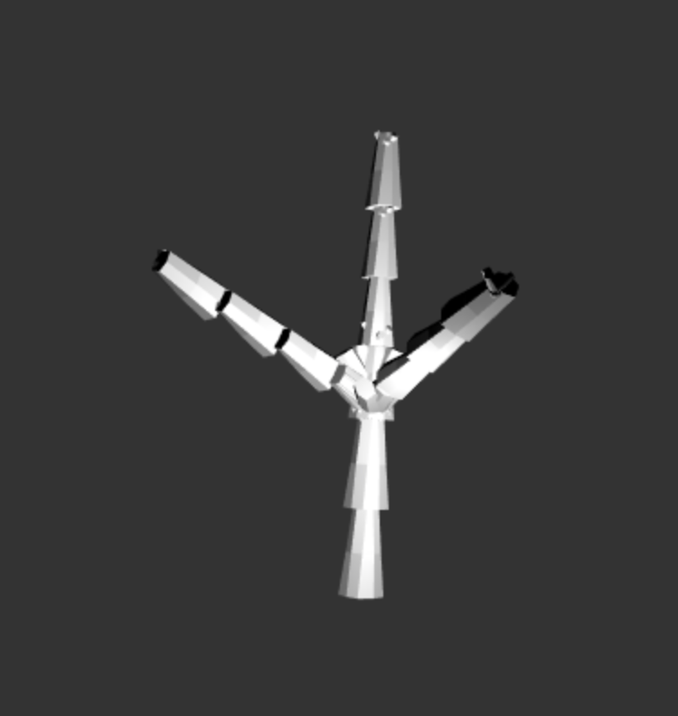
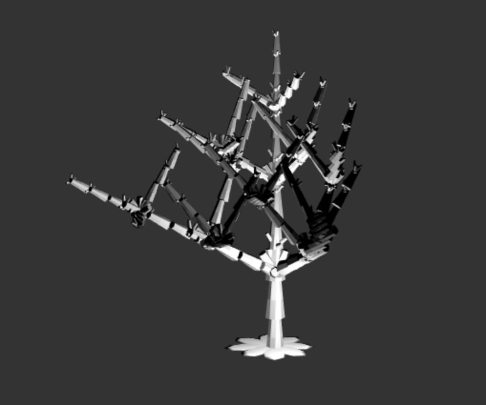

# irovira || HW4 || L-System

I wanted to create a tree with small blooms.
## Rules
A = [&FF[f]F[f]A]////[&FF[f]F[f]A]////[&FF[f]F[f]A]

[ =  Push current turtle onto stack
] = Pop turtle off the stack
& = Pitch the branch up
F = Move forward
f = draw a flower bloom
A = do nothing/only a control element

## Design Choices
I based my tree design on a Houdini tutorial found here: http://www.sidefx.com/docs/houdini/nodes/sop/lsystem.html

In order to apply the new settings, press Load Scene.

One can manipulate:
1. Inital Axiom: The string that determines the overall strucutre of the tree
2. Spread: The seperation and rotation of the branch around the main trunk
3. Iter: This controls how many times the LSystem exands the axiom.

Iter = 1

Iter = 2

Iter = 3

## Problems Encountered
My biggest challenge was appending another .obj besides the branch into the master VBO.
I can load it in but if I append the data it destroys the mesh or the geoemtry flies off into space.

In addition, it gets super slow to load after 3 iterations even though I only create and push one VBO.

In addition, I wanted to work on this longer but I spent too much time on integrating the webgl-obj-loader.
I needed to move on to homework 5.

